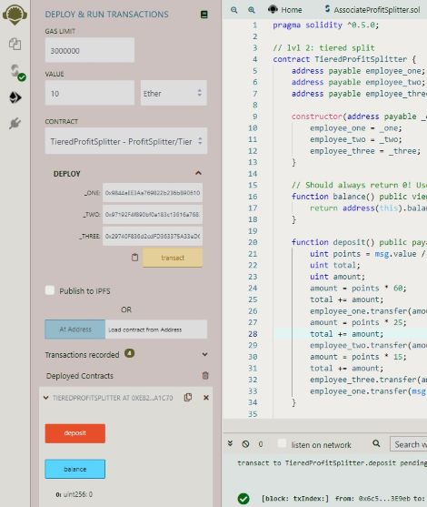

# SCPS: Profit Splitter

## Welcome to Smart Contract Profit Splitter (SCPS) documentation. SCPS utilizes Solidity smart contracts to distribute profits to employees.

## Requirements:

- Remix IDE
  - Will be used to create and deploy our contracts
- Ganache
  - Deploying and testing contract on a developmental chain 
- MetaMask
  - Connect to our developmental Chain (localhost:8545)

> ## Associate Profit Splitter:
>
>- Objective: Pay Associate-level employees
>
>- This contract will accept Ethereum and divide the Ethereum evenly among the associate level employees. This will allow the HR department to pay employees quickly and efficiently.
>
>- Testing Contract
>
>   The first step is to compile the contract, we will need to navigate to the Compile tab on Remix and compile contract. Then navigate to the Deploy tab in Remix, deploy the contract to Ganache chain by connecting to Injected Web3 and ensuring MetaMask is pointed to localhost:8545.
>
>   You will need to fill in the constructor parameters with the designated employee addresses. You are now ready to utilize and test the deposit function!

> ## Tiered Profit Splitter:
>
> - Objective: Distribute profits to different tiers of employees.
>
> - TieredProfitSplitter is a contract that will distribute different percentages of incoming Ethereum to employees at different tiers or levels. For this contract the distribution percentage are as followed, the CEO gets paid 60%, CTO 25%, and Bob gets 15%.
> - Testing Contract
>
>   Navigate to the Compile tab on Remix and compile contract. Then navigate to the Deploy tab in Remix, deploy the contract to Ganache chain by connecting to Injected Web3 and ensuring MetaMask is pointed to localhost:8545.
>
>   You can now test the contract by depositing various Ether values (greater than 100 wei). Note: The balance function should always remain 0, no Ethereum should be stored in the contract. All Ethereum Should be distributed.

> ## Deferred Equity Plan:
>
> - Objective: Distribute company shares for employees in a "deferred equity incentive plan" automatically.
>
> - DeferredEquityPlan contract models traditional company stock plans. This contract will automatically manage 1000 shares with an annual distribution of 250 over 4 years to an employee.
> - Testing Contract
>
>   Navigate to the Compile tab on Remix and compile contract. Then navigate to the Deploy tab in Remix, point MetaMask to the Kovan or Ropsten network. Ensure you have test Ether on this network.
> No Ethereum is used in this contract. 
> 
>
